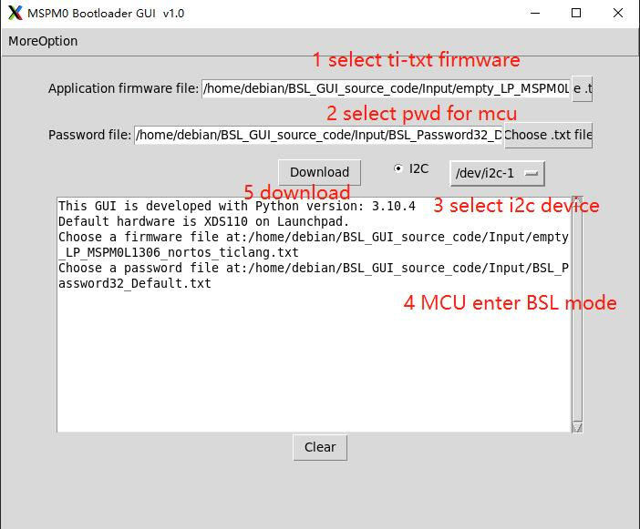

# BSL upgrade tool for MSPM0L1306

# Usage
## step 1
`python MSPM0_BSL_GUI.py`
## step 2
```
a select ti-txt firmware
b select pwd.txt for mcu
c select I2C device
d make MCU enter BSL mode
e start download
```

Action Screenshot:



# FAQ
## 1 how to enter BSL mode?
### Two way:
### 1 pull up PA18 of MCU and reset it.
### 2 If the mcu is already running with the firmware for beaglemod.You can send I2C command to achieve this.
### command example:
`i2ctransfer -y 1 w1@0x13 0x01`
